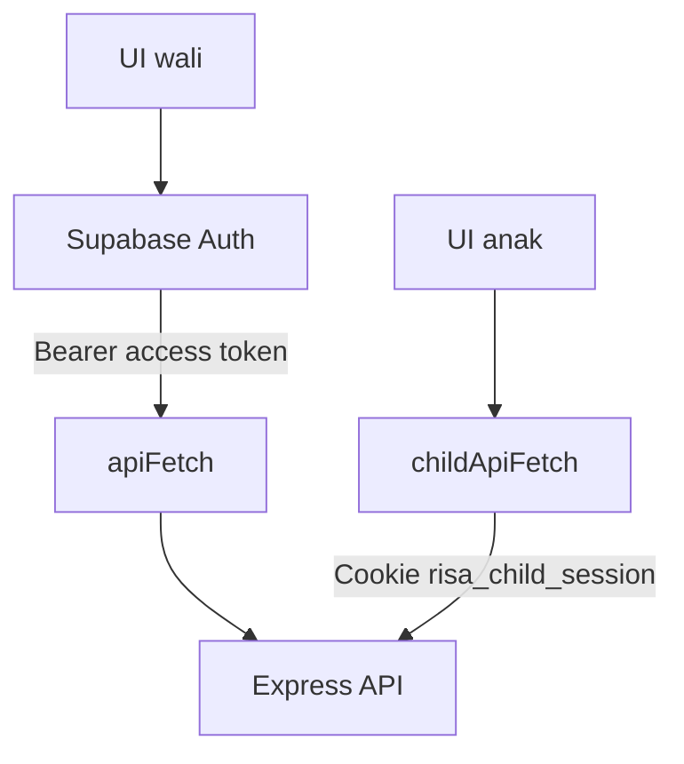

# RISA — Remaja Indonesia Sehat

RISA adalah platform edukasi kesehatan reproduksi berbasis web untuk membantu remaja Indonesia belajar melalui microlearning, aktivitas interaktif, dan permainan edukatif.

Repository ini berisi aplikasi frontend RISA. Backend Express, database, autentikasi sesi anak, consent, progres belajar, post-test, dan fitur komunitas dikelola dalam repository terpisah.

## Tautan Penting

- Frontend production: [https://risa-v2.vercel.app](https://risa-v2.vercel.app)
- Backend repository: [RISA-Remaja-Indonesia-Sehat/server-v3](https://github.com/RISA-Remaja-Indonesia-Sehat/server-v3)
- Dokumentasi API: [RISA API Documentation](https://documenter.getpostman.com/view/58428062/2sBYB2qSzx)

## Fitur Utama

- Tujuh chapter pembelajaran kesehatan reproduksi.
- Microlearning dan permainan interaktif pada setiap chapter.
- Chapter 1 dapat dicoba sebagai guest.
- Progres chapter berurutan untuk anak yang sudah login.
- Post-test setelah Chapter 1–7 selesai.
- Registrasi dan login wali melalui Supabase Auth.
- Dashboard wali untuk melihat akun anak dan progres belajar.
- Alur parental consent sebelum pembuatan profil anak.
- Profil anak dengan username, PIN enam angka, dan avatar.
- Login anak menggunakan sesi berbasis cookie HttpOnly.
- Temanku sebagai ruang komunitas untuk anak yang sudah login.

### Materi Pembelajaran

| Chapter | Topik |
|---|---|
| 1 | Kenali Tubuhmu |
| 2 | Pahami Menstruasi |
| 3 | Jaga Kebersihan |
| 4 | Batas & Keamanan |
| 5 | Kebiasaan Sehat |
| 6 | HPV & Vaksin |
| 7 | Kenali IMS |

## Tech Stack

- [Next.js 16](https://nextjs.org/) dengan App Router
- [React 19](https://react.dev/)
- [TypeScript](https://www.typescriptlang.org/)
- [Tailwind CSS 4](https://tailwindcss.com/)
- [Supabase JS](https://supabase.com/docs/reference/javascript/introduction)
- [Zustand](https://zustand.docs.pmnd.rs/)
- [Motion](https://motion.dev/)
- [Lucide React](https://lucide.dev/)
- [dnd kit](https://dndkit.com/)

## Arsitektur

RISA memisahkan autentikasi wali dan anak. Keduanya tidak boleh diperlakukan sebagai sesi yang sama.



### Autentikasi Wali

Wali melakukan registrasi dan login melalui Supabase Auth. `lib/api/client.ts` membaca Supabase session dan mengirim access token ke backend sebagai Bearer token.

Gunakan `apiFetch` untuk endpoint yang membutuhkan identitas wali, misalnya:

- profil atau dashboard wali;
- pembuatan dan validasi consent;
- pembuatan profil anak setelah consent disetujui.

### Autentikasi Anak

Anak login menggunakan username dan PIN melalui backend. Jika login berhasil, backend membuat cookie HttpOnly bernama `risa_child_session`.

Gunakan `childApiFetch` untuk endpoint anak. Client tersebut selalu mengirim request dengan `credentials: "include"` agar browser menyertakan cookie sesi.

`hooks/useChildSession.ts` memeriksa sesi melalui `GET /api/child/me` dan menyediakan:

- data profil anak;
- daftar chapter yang sudah selesai;
- status post-test;
- status loading dan error sesi;
- fungsi refresh dan logout.

Frontend tidak dapat membaca cookie HttpOnly secara langsung. Validitas sesi selalu ditentukan oleh backend.

### Consent dan Pembuatan Profil Anak

Form setup anak hanya ditampilkan setelah consent berhasil diverifikasi:

```text
checking -> valid -> tampilkan form
         -> invalid -> tampilkan error dan tombol kembali ke dashboard
```

Validasi frontend mencegah pengguna mengisi form dengan consent yang jelas tidak valid. Backend tetap menjadi sumber kebenaran dan harus memeriksa bahwa consent:

- berstatus `APPROVED`;
- belum kedaluwarsa;
- belum digunakan;
- dimiliki wali yang sedang login.

### Progres Pembelajaran

- Chapter 1 dapat diakses tanpa login.
- Guest dinyatakan menyelesaikan Chapter 1 jika memperoleh minimal 4 dari 6.
- Progres guest disimpan sementara di `localStorage` dan dapat dipindahkan saat profil anak dibuat.
- Chapter 2–7 membutuhkan sesi anak dan dibuka secara berurutan.
- Post-test baru dapat dibuka setelah seluruh Chapter 1–7 selesai.
- Aturan skor setiap game dapat berbeda. Jangan menerapkan aturan Chapter 1 sebagai aturan global untuk seluruh game.
- `LearningAccessGuard` berfungsi sebagai pembatas navigasi dan pengalaman pengguna, bukan pengganti validasi backend.
- Untuk pengguna terdaftar, backend merupakan sumber kebenaran atas progres dan kelulusan.

## Rute Utama

| Rute | Keterangan | Akses |
|---|---|---|
| `/` | Peta progres pembelajaran | Publik |
| `/chapters/chapter-1` | Materi Chapter 1 | Publik |
| `/chapters/chapter-1/game` | Game Chapter 1 | Publik |
| `/chapters/chapter-2` sampai `/chapters/chapter-7` | Materi lanjutan | Sesi anak dan progres sebelumnya |
| `/chapters/chapter-[number]/game` | Game masing-masing chapter | Mengikuti akses chapter |
| `/post-test` | Evaluasi setelah seluruh chapter | Sesi anak dan Chapter 1–7 selesai |
| `/temanku` | Komunitas anak | Sesi anak |
| `/child/login` | Login anak | Publik |
| `/child/setup` | Pembuatan profil anak | Wali dan consent valid |
| `/guardian/register` | Registrasi wali | Publik |
| `/guardian/login` | Login wali | Publik |
| `/guardian/consent` | Persetujuan wali | Sesi wali |
| `/guardian/dashboard` | Dashboard dan progres anak | Sesi wali |

## Struktur Project

```text
app/
├── chapters/              # Materi dan game Chapter 1–7
├── child/                 # Login dan setup profil anak
├── guardian/              # Register, login, consent, dan dashboard wali
├── post-test/             # Halaman evaluasi akhir
├── temanku/               # Halaman komunitas anak
├── globals.css
├── layout.tsx
└── page.tsx

components/
├── auth/                  # Guard akses, login prompt, dan logout anak
├── game/                  # Komponen umum hasil permainan
├── home/                  # Peta progres dan shortcut halaman utama
├── modules/               # Renderer konten microlearning
└── profile/               # Profil dan pemilih avatar

hooks/
└── useChildSession.ts     # State dan pemeriksaan sesi anak

lib/
├── api/                   # Client API untuk wali dan anak
├── game/                  # Aturan skor, evaluator, dan progres
├── modules/               # Tipe serta utilitas modul pembelajaran
├── navigation/            # Validasi tujuan redirect
└── supabase/              # Supabase browser client

types/                     # Tipe data bersama dan runtime validation
public/                    # Gambar, audio, avatar, dan aset statis
```

Alias import `@/*` mengarah ke root project dan dikonfigurasi dalam `tsconfig.json`.

## Persyaratan Lokal

- Node.js 20.9 atau lebih baru.
- npm.
- Backend RISA yang sudah berjalan.
- Project Supabase untuk autentikasi wali.

## Menjalankan Project

### 1. Clone repository

```bash
git clone https://github.com/RISA-Remaja-Indonesia-Sehat/risa-v3.git
cd risa-v3
```

### 2. Install dependency

```bash
npm ci
```

Gunakan `npm ci` untuk instalasi awal yang konsisten dengan `package-lock.json`. Gunakan `npm install <package>` hanya ketika memang menambah atau memperbarui dependency.

### 3. Buat environment lokal

Buat file `.env.local` di root project:

```env
NEXT_PUBLIC_API_URL=http://localhost:5000
NEXT_PUBLIC_SUPABASE_URL=https://your-project.supabase.co
NEXT_PUBLIC_SUPABASE_PUBLISHABLE_KEY=your_supabase_publishable_key
```

| Variable | Kegunaan |
|---|---|
| `NEXT_PUBLIC_API_URL` | Base URL backend Express tanpa trailing slash |
| `NEXT_PUBLIC_SUPABASE_URL` | URL project Supabase untuk autentikasi wali |
| `NEXT_PUBLIC_SUPABASE_PUBLISHABLE_KEY` | Publishable key Supabase yang digunakan browser |

Jangan menaruh `SUPABASE_SECRET_KEY`, service-role key, `DATABASE_URL`, atau secret backend lain di frontend. Semua variable berawalan `NEXT_PUBLIC_` dapat tersedia di browser.

File `.env*` telah diabaikan oleh Git. Jangan menghapus aturan tersebut atau meng-commit `.env.local`.

### 4. Jalankan backend

Pastikan backend RISA tersedia sesuai nilai `NEXT_PUBLIC_API_URL`. Ikuti petunjuk pada [repository backend](https://github.com/RISA-Remaja-Indonesia-Sehat/server-v3).

### 5. Jalankan frontend

```bash
npm run dev
```

Buka [http://localhost:3000](http://localhost:3000).

## Script

| Command | Kegunaan |
|---|---|
| `npm run dev` | Menjalankan development server |
| `npm run build` | Membuat production build |
| `npm run start` | Menjalankan hasil production build |
| `npm run lint` | Menjalankan ESLint |

Sebelum mengirim perubahan, jalankan:

```bash
npm run lint
npm run build
```

Project saat ini belum memiliki script automated test di `package.json`. Pengujian alur autentikasi, consent, progres, post-test, dan Temanku tetap perlu dilakukan pada browser yang terhubung ke backend.

## Integrasi Backend

Frontend tidak memiliki backend tambahan di dalam `app/api`. Semua data sensitif dan business logic berikut harus tetap melalui backend Express:

- data wali dan anak;
- consent;
- autentikasi dan sesi anak;
- progres chapter;
- post-test;
- Temanku;
- aturan akses dan validasi server.

Kontrak endpoint lengkap tersedia di [dokumentasi Postman RISA](https://documenter.getpostman.com/view/58428062/2sBYB2qSzx).

## Cookie dan CORS

Alur sesi anak membutuhkan konfigurasi frontend dan backend yang sesuai:

- request anak mengirim `credentials: "include"`;
- backend mengizinkan origin frontend secara eksplisit;
- backend mengaktifkan CORS credentials;
- cookie memiliki domain dan path yang benar;
- deployment HTTPS menggunakan konfigurasi `Secure` dan `SameSite` yang sesuai.

Jangan mencoba menyimpan atau membaca `risa_child_session` melalui JavaScript frontend karena cookie tersebut harus tetap HttpOnly.

## Troubleshooting

### `NEXT_PUBLIC_API_URL belum diatur`

Pastikan `.env.local` tersedia, nama variable benar, lalu restart development server setelah mengubah environment variable.

### Request anak menghasilkan `401 Child belum login`

Periksa secara berurutan:

1. request login anak berhasil;
2. response login memiliki header `Set-Cookie`;
3. cookie `risa_child_session` tersimpan di browser;
4. request `/api/child/me` mengirim cookie;
5. request frontend menggunakan `credentials: "include"`;
6. konfigurasi CORS dan cookie backend sesuai dengan origin frontend.

### Browser menampilkan `Failed to fetch`

Periksa bahwa backend sedang berjalan, `NEXT_PUBLIC_API_URL` benar, koneksi HTTPS tidak bermasalah, dan origin frontend diizinkan oleh backend.

### Chapter atau post-test kosong

Jangan langsung menganggap progres hilang. Periksa status loading dan error dari `useChildSession`, response `/api/child/me`, cookie sesi anak, serta konfigurasi CORS. UI tidak boleh merender keadaan kosong ketika pemeriksaan sesi gagal.

### Consent ditolak sebelum setup anak

Pastikan wali masih login dan `consentRequestId` tersedia di URL. Backend dapat menolak consent yang tidak ditemukan, bukan milik wali tersebut, belum disetujui, sudah kedaluwarsa, atau sudah digunakan.

## Deployment

Frontend saat ini dideploy melalui Vercel:

[https://risa-v2.vercel.app](https://risa-v2.vercel.app)

Tambahkan ketiga environment variable frontend pada konfigurasi deployment. Setelah URL frontend atau backend berubah, perbarui juga konfigurasi CORS dan cookie pada backend.

## Catatan Pengembangan

- Gunakan `apiFetch` untuk request dengan autentikasi wali.
- Gunakan `childApiFetch` untuk request dengan sesi anak.
- Jangan menyimpan token wali atau PIN anak di `localStorage`.
- Jangan mengandalkan route guard frontend sebagai validasi keamanan.
- Jangan menggandakan aturan game di komponen UI. Simpan aturan pada modul game yang sesuai dan pastikan backend menggunakan aturan yang konsisten bila data tersebut menentukan progres.
- Pertahankan state loading, error, dan empty state sebagai kondisi yang berbeda.
- Perbarui README ini jika environment variable, struktur route, atau alur autentikasi berubah.

## Status Project

RISA masih dikembangkan secara aktif. Fitur, konten pembelajaran, dan kontrak API dapat berubah. Gunakan branch dan dokumentasi API terbaru sebelum mengembangkan fitur baru.

---

Made for **RISA — Remaja Indonesia Sehat**.
